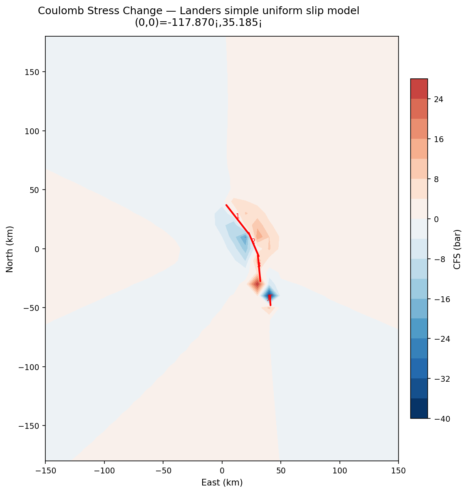
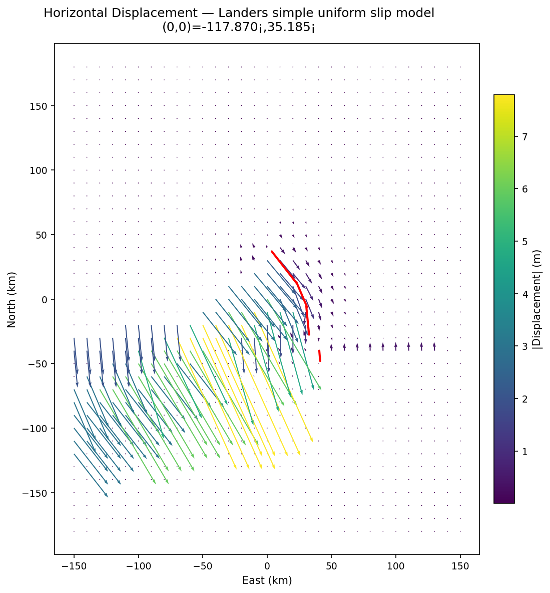
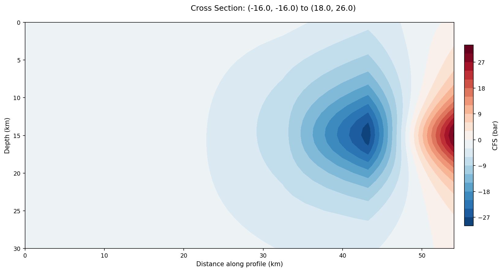
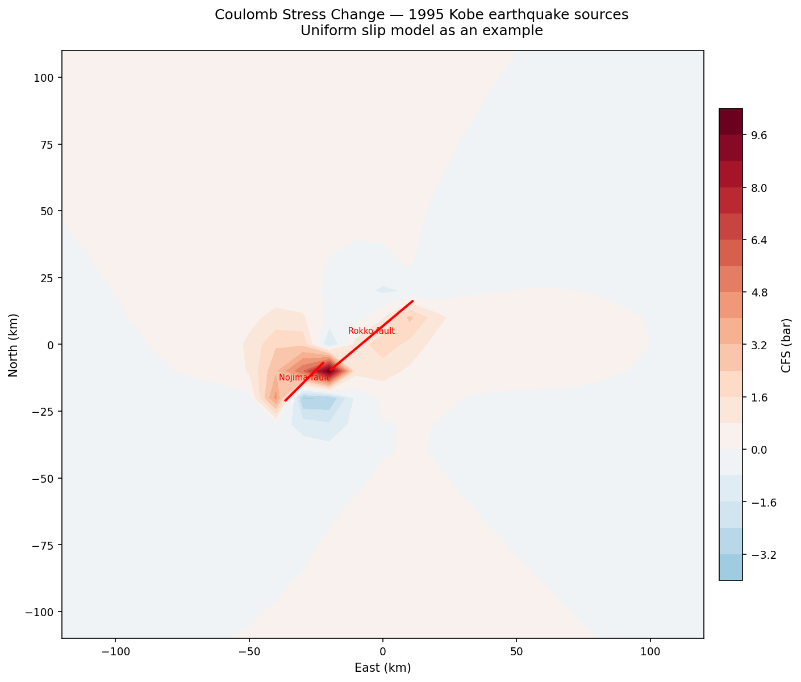
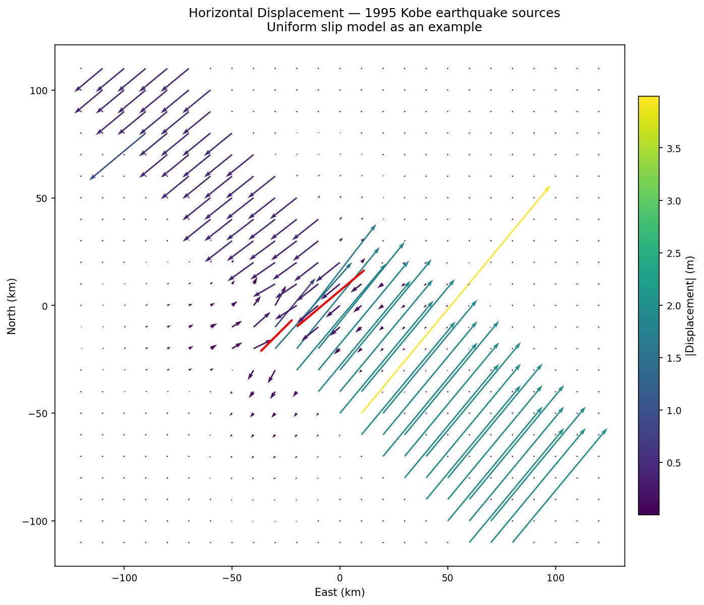
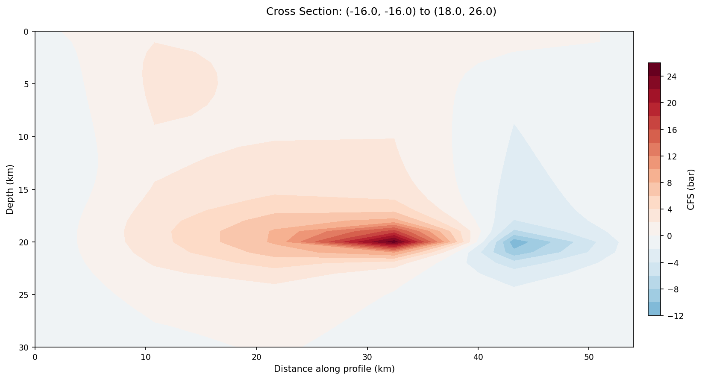
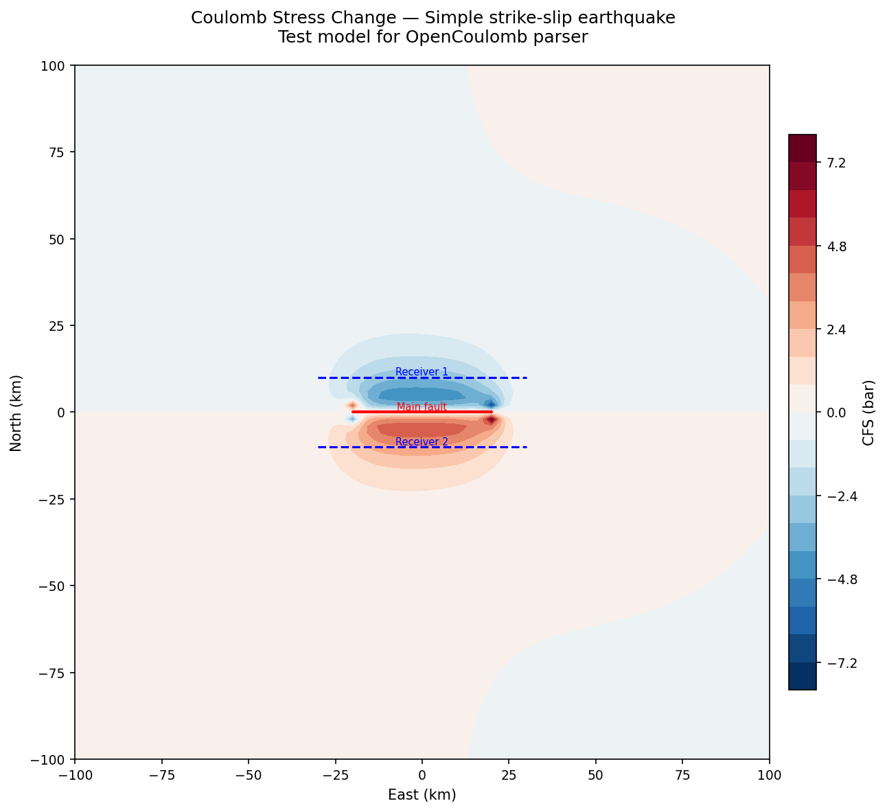
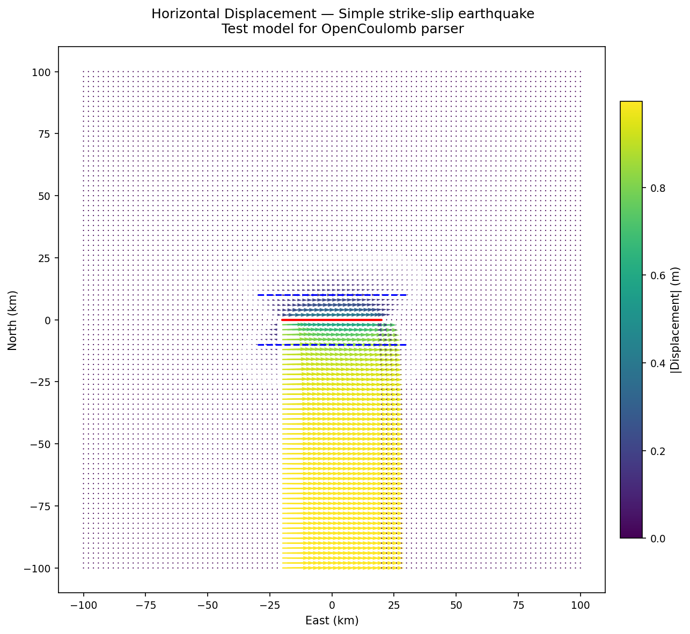

# OpenCoulomb Demo Report

Test run performed on 2026-02-27 using OpenCoulomb v0.1.0 against three earthquake models bundled with the project test fixtures.

---

## 1. 1992 Landers Earthquake (M7.3, California)

**Model:** 4 fault segments with uniform 2–3 m right-lateral slip, vertical dip (90°). Origin at −117.87°E, 35.185°N.

| Parameter | Value |
|-----------|-------|
| Grid | 300 × 360 km, 10 km spacing, 1,147 points |
| Observation depth | 7.5 km |
| Max CFS | +27.7 bar |
| Min CFS | −38.6 bar |
| Max displacement | 7.8 m |

### CFS Map



Classic butterfly pattern of a multi-segment strike-slip rupture. Red lobes (positive CFS, failure promoted) extend NW and SE off the fault tips. Blue stress shadows (clamped zones) flank the fault. The stepped geometry of the 4 segments creates concentrated stress at the junctions — exactly where the 1992 Big Bear aftershock occurred.

### Displacement Field



Quiver arrows show the expected right-lateral pattern: SW-directed motion east of the fault, NE-directed west of it. Peak displacement ~7.8 m near the fault trace.

### Vertical Cross-Section



Dominated by a deep stress shadow (blue, −27 bar) centered at ~15 km depth directly beneath the fault. Positive CFS (red) appears at the profile's SE end, representing the stress transfer toward adjacent structures.

---

## 2. 1995 Kobe Earthquake (M6.9, Japan)

**Model:** 2 faults — Nojima (strike=45°, dip=80°, 2.0 m left-lateral + 0.2 m reverse) and Rokko (strike=230°, dip=85°, 0.5 m slip).

| Parameter | Value |
|-----------|-------|
| Grid | 240 × 220 km, 10 km spacing, 575 points |
| Observation depth | 10 km |
| Max CFS | +10.1 bar |
| Min CFS | −3.3 bar |
| Max displacement | 4.0 m |

### CFS Map



Asymmetric lobes due to oblique-slip on the Nojima fault and interaction between the two faults. The dominant positive CFS (up to 10 bar) is concentrated SW of the junction. The four-lobed pattern is distorted by the reverse component.

### Displacement Field



The displacement field is dominated by the Nojima fault's larger slip. Vectors rotate around the fault trace with peak displacement ~4 m.

### Vertical Cross-Section



Strong positive CFS anomaly centered at ~20 km depth (below the fault base), with a secondary negative lobe at the SE end of the profile. This deeper stress loading is characteristic of oblique faulting.

---

## 3. Simple Strike-Slip (Synthetic Test Case)

**Model:** 1 east-striking vertical fault with 1 m left-lateral slip + 2 receiver faults at ±8 km.

| Parameter | Value |
|-----------|-------|
| Grid | 200 × 200 km, 2 km spacing, 10,201 points |
| Observation depth | 10 km |
| Max CFS | +7.4 bar |
| Min CFS | −7.4 bar |
| Mean CFS | ~0 bar (symmetric) |
| Max displacement | 1.0 m |

### CFS Map



Textbook four-lobed pattern. Red lobes (positive CFS) at the fault tips along-strike, blue lobes (stress shadow) perpendicular to the fault. The two receiver faults (blue dashed lines) sit in the stress shadow zone — CFS is negative on them, meaning the main earthquake made them less likely to fail. Perfectly symmetric mean CFS of ~0.

### Displacement Field



Clean left-lateral pattern centered on the source fault, with peak ~1 m near the fault.

---

## Conclusion

All three models computed and plotted successfully. The stress patterns match expected seismological behavior — four-lobed CFS for strike-slip, asymmetric for oblique-slip, and correct displacement field orientations. The Okada elastic half-space engine produces physically correct results across different fault geometries and slip types.

## Commands Used

```bash
# Inspect models
opencoulomb info <input.inp>

# Compute all output formats
opencoulomb compute <input.inp> -o <output_dir> -f all -v

# Generate plots
opencoulomb plot <input.inp> -o <output.png> -t cfs --dpi 150
opencoulomb plot <input.inp> -o <output.png> -t displacement --dpi 150
opencoulomb plot <input.inp> -o <output.png> -t section --dpi 150
```
